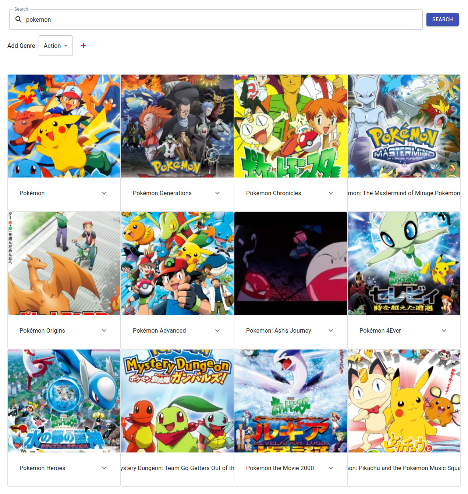
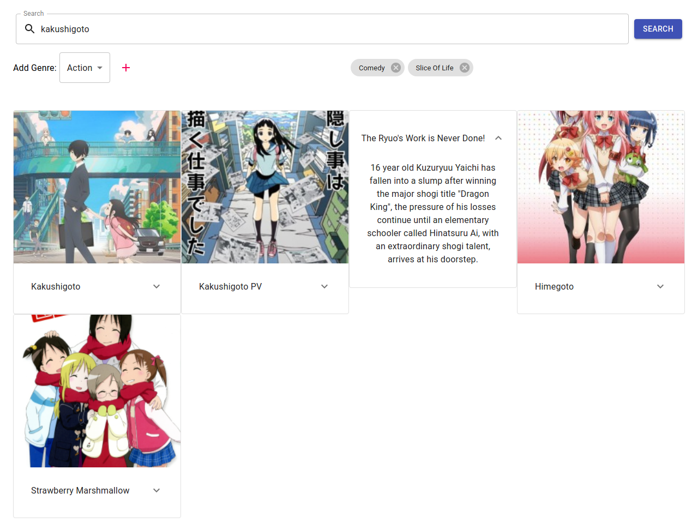
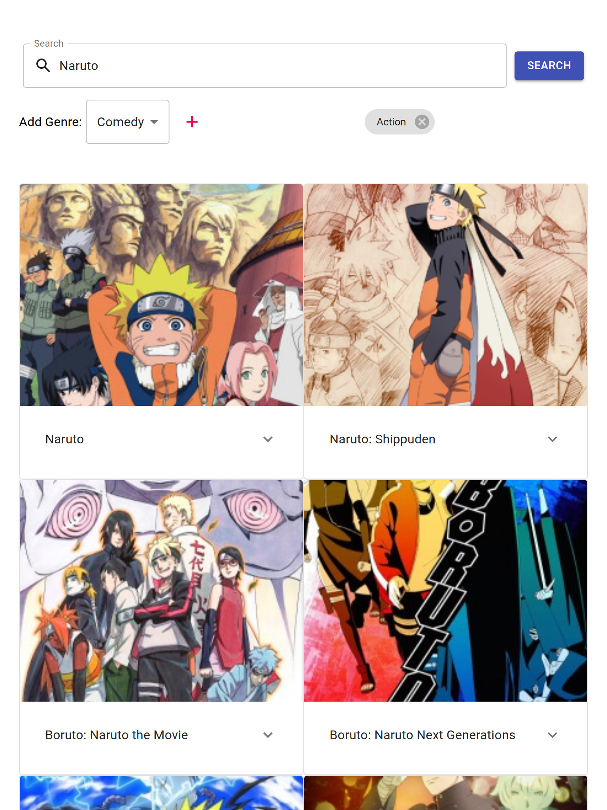

# Anime Searcher
This is my [Microsoft Student Accelerator] Phase 1 Front End project.
It allows you to search anime on [AniList] via their API.

[You can view it here.](https://msa-2020-phase1.azurewebsites.net/)

Written in/using:

- [Typescript]
- [React]
- [Material-Ui]
- [AniList]

## Build Pipeline

The Azure Pipeline is triggered whenever a commit occurs to the `master` or `develop` branch.
The pipeline will:

- Install Node and npm.
- Build the React app.
- Archive the `build/` folder into a `zip`.
- Publish the built artifact.

Then, if the pipeline was triggered by the `master` branch,
the zipped artifact will be deployed onto an Azure web service.

(The build pipeline is not triggered when the only files changed in a commit
are the `README.md` file or `screenshots/` folder.
This is because these files are not used in the build
and thus it does not matter if they are changed.)

## Screenshots

### Search

### Responsive

#### On a small phone

#### On a tablet

[Microsoft Student Accelerator]: https://nzmsa.netlify.app/MSAProgramme
[AniList]: https://anilist.co/
[Typescript]: https://www.typescriptlang.org/
[React]: https://reactjs.org/
[Material-Ui]: https://material-ui.com/
