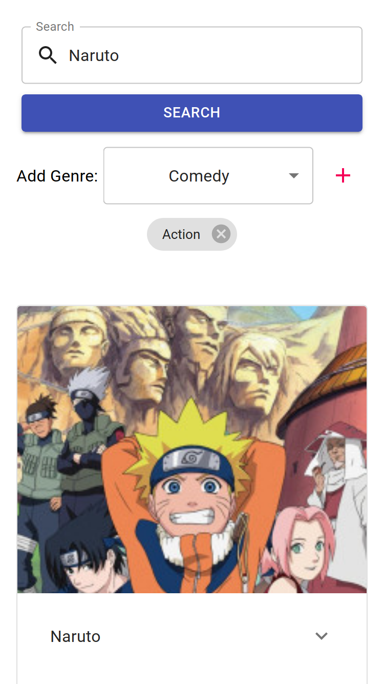

# Anime Searcher
This is my [Microsoft Student Accelerator] Phase 1 Front End project.
It allows you to search anime on [AniList] via their API.

[You can view it here.](https://anime-searcher.msa.hiru.dev/)

Written in/using:

- [Typescript]
- [React]
- [Material-Ui]
- [AniList]

## Screenshots

### Search

### Responsive

#### On a small phone

#### On a tablet

[Microsoft Student Accelerator]: https://nzmsa.netlify.app/MSAProgramme
[AniList]: https://anilist.co/
[Typescript]: https://www.typescriptlang.org/
[React]: https://reactjs.org/
[Material-Ui]: https://material-ui.com/
